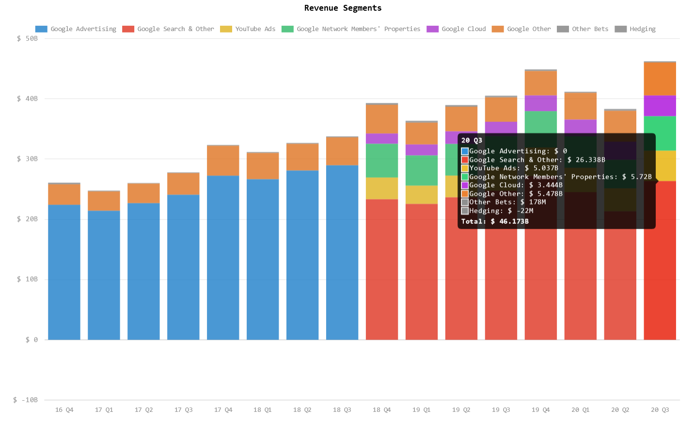

  
What was once seen as a harmless way of learning and gathering information has quickly evolved into a universal source of truth underlying an advertising platform.  

# How Google Makes Money  
  
Consider that Google's primary source of revenue over the [last 16 consecutive quarters has been Advertising, Search and AdWords](https://hypercharts.co/googl).  The chart below can highlight just how much they make in "informing" users:  

  

> *Wait a minute!  They haven't had advertising revenue as of 2018 Q4* :eyes:    

Excellent observation! However, it just so happens that they relabeled the revenue streams in what is likely a more appealing way to present the information. Consider this blurb from their [2018 Q3 financial statement](https://www.sec.gov/Archives/edgar/data/1652044/000165204418000035/goog10-qq32018.htm#s69BA304FD4DF5F498A2075980C7D5B76) under *Note 1 - Nature of Operations*:  
> *We generate revenues primarily by delivering relevant, cost-effective online advertising.*  

It's slightly ambiguous, but Google provides "cost-effective online advertising" by making it their business to understand users far better than any corporation seeking out clients. They create a competitive space where retailers and service providers can compete on keywords that **YOU** search for in your process of learning or gathering information.  

# Does Google Skew Results  

The short answer is: they skew the results to be better tailored to your search needs.  There is certainly some merit in providing more accurate results when you search for a topic, but not to the degree of changing the overall outcomes of the results by providing you with the insights that Google would prefer you receive. As Google has an incentive to provide your information to the highest bidder, it can lead to a bias towards these areas which result in something called Search Engine Manipulation Effect (SEME). SEME can have an impact on areas as wide and far reaching to the items you purchase, news outlets you follow, [political candidates you choose](https://www.pnas.org/content/early/2015/08/03/1419828112.abstract?sid=2096de02-a382-4aeb-89e0-df794a4ca03a), and even [medical research](https://www.ncbi.nlm.nih.gov/pmc/articles/PMC7068473/) available to you.  

Here are a couple of insights regarding this SEME:  
  
- [**Why Google Poses a SeriousThreat to Democracy, and How to End That Threat**](https://www.judiciary.senate.gov/imo/media/doc/Epstein%20Testimony.pdf) - A research scientist who collected data over the course of several years to skew public bias towards a single party. Most of Epstein's work has been around politics and how search engine suggestions could effect outcomes.  [See here](https://aibrt.org/downloads/EPSTEIN_MOHR_%26_MARTINEZ_2018-WPA-The_Search_Suggestion_Effect-SSE-WP-17-03.pdf)  
- [**Health Misinformation in Search and Social Media**](https://uwspace.uwaterloo.ca/bitstream/handle/10012/15268/Ghenai_Amira.pdf;jsessionid=D5EB7F01A750F36F75CC4E9F42E1B937?sequence=3) - In Chapter 5, the study *Results* includes a discussion that states:  
>*"...search results have a strong effect on people’sability to determine the efficacy of medical treatments.  When people are biased towardscorrect information, they perform better then when biased towards incorrect information.Further, we noticed that when exposed to incorrect information, participants perform worsethan when no search results are provided."*  

# What does Google Know about Me  

It is a worthy exercise to get your information from Google to see what all the company has of your user information. Here's a video on how to do just that:  

  
  
Or simply [follow this link to see what information of yours they have collected.](https://takeout.google.com/settings/takeout)  

# What Are My Search Engine Options  

There are a ton of search engines you could opt for, but some certainly perform better than others with differing incentives.  Here are a few I have used in the past and my go-to search engine as well:  

- [**StartPage**](startpage.com/) - My favourite, has always provided the ultimate privacy with great results and filtering :lock:      
- [**DuckDuckGo**](duckduckgo.com/) - A US based search engine,  :duck:  
- [**Bing**](bing.com/) - Okay, not one I would personally recommend.  Definitely think it is cool that they have a [rewards program for search](https://www.microsoft.com/en-us/rewards/search-and-earn) :joy:  
- [**Yandex**](yandex.com/) - Predominately an Eastern European search engine with [useful other tools, similar to Google](https://tech.yandex.com/) :hammer:    
-  [**Swisscows**](https://swisscows.com/) - A family friend search engine that similarly respects your user privacy and data by not collecting information :cow:  

There are a lot more worth considering today. [Here's a list of others](https://www.searchenginejournal.com/alternative-search-engines/271409/)  

Don't allow Google to have a monopoly on your thinking and inquiries  

