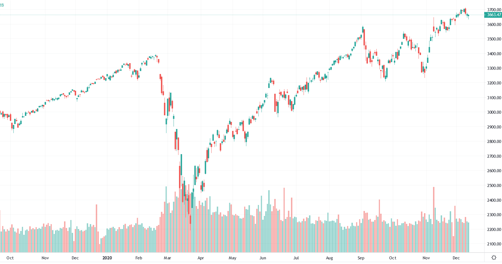

  
  

# The choice we can't make  

It's a poor way to start a post, but seems like an accurate way to begin given how we have ever-increasing click bait articles trying to capture our attention. Inflation is the choice that is being made on our behalf by the powers that be (e.g. government, federal reserve, central banks) to ensure we can "save our economy".  Instead of the traditional route of enabling businesses to build and crater by their own accord, government stimulus and quantitative easing will allow haphazard business elites to devalue their pre-existing debt by increasing the overall cost of goods and services.  

# A summary in the news of what disproportionately relying on government brings  
  
Here's a nice 10 minute summary of the issues we are likely to experience going forward:  

   

So, the wealthy are getting wealthier at a rate of growth faster than the S&P could ever dream of while [states such as Alabama, Mississippi, Arkansas and Florida see the biggest demand in Foodbanks in their history](https://apnews.com/article/race-and-ethnicity-hunger-coronavirus-pandemic-4c7f1705c6d8ef5bac241e6cc8e331bb).     

Here's a tweet from a twitter bird showing the early warning signs of the canary in the coal mines.  

  
Meanwhile, since the pandemic hit, the market cratered and recovered to all time highs by the time it was August    
  

> *Well, the market could probably tell the early signs of the lockdowns!*  

Let's keep in mind, just for a moment, that the market doesn't have the crystal ball we assume and we remember the issues running at the time for liquidity as people pulled their money out in droves.  What followed, with the market cratering:  

- [The Fed is Buying ETFs Today](https://www.nytimes.com/2020/05/12/business/dealbook/fed-bond-etf.html)  
- [Fed Reveals Which Bond ETFs it Purchased](https://www.thinkadvisor.com/2020/06/01/fed-reveals-which-bond-etfs-it-purchased/)  
- [The Fed has never bought ETFs before. Here's why that's changing](https://www.barrons.com/articles/why-the-federal-reserve-is-now-buying-etfs-51585076254)  
- [If You Trust the Fed, Buy These Two Bond ETFs](https://www.thestreet.com/investing/fed-is-buying-bonds-here-are-2-bond-etfs-technical-analysis)  
- And the list goes on, for those who were paying attention  

Unfortunately, with so much distracting us in general, it's hard to pin point the issues when they happened and what, specifically, has caused us such a problem.    

> *It is well enough that people of the nation do not understand our banking and monetary system, for if they did, I believe there would be a revolution before tomorrow morning*   
> [Henry Ford](https://www.goodreads.com/quotes/34770-it-is-well-enough-that-people-of-the-nation-do)  

# In Summary of what has happened financially in 2020  

People panicked as they lost their jobs and quickly confined themselves into their homes to save everyone's life.  As a coverall approach, [the federal reserve printed trillions of dollars on the American peoples' behalf to 'resolve the issue'](https://www.federalreserve.gov/monetarypolicy/bst_recenttrends.htm).  As an indirect consequence, people have lost value of the few bucks, if any, that the government has sent their way to 'relieve' their financial woes.  Rather than putting people back to work, the Federal reserve prefers to print infinite monies in a way that enriches those with direct exposure to financial markets to earn such strong returns it's impossible for quantitative algorithms to compete using logic.  Market euphoria rules the day by pumping billions into [zombie companies that are completely subsidized by leverage](https://www.bloomberg.com/news/articles/2020-05-19/america-s-zombie-companies-are-multiplying-and-fueling-new-risks). Being profitable no longer matters as much as being looked after by big brother federal reserve's wallet at the expense of the american tax payer.  

# What can you do about the imminent inflation    

Buy physical or cryptocurrency assets as soon as you can and [HODL](https://www.cyberdefinitions.com/definitions/HODL.html).  Do so before your money is worth so little that a 4% high interest savings still won't make you enough returns to give your bank account some relief.  
