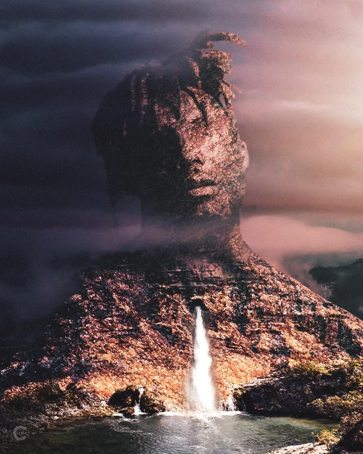

     
  
# Eternal legend  

A freestyle king permeating lyricism from every single pore, Juice WRLD embodies affection and crude reality into each syllable. This young artist managed to create music at the the drop of any type of old or new beat to promote ideas through a dense vocabulary and imagery painting painful and powerful portraits of common predicaments for a young or old soul. In 2020, Juice WRLD topped the charts with a post humous album titled ["Legends Never Die" which hit the Billboards for No. 1](https://www.wsj.com/articles/juice-wrld-pop-smoke-and-mac-miller-rap-stars-who-died-young-are-among-the-biggest-albums-of-the-year-11596639454) which net the most album sales in 2020, according to [Bloomberg](https://www.bloomberg.com/graphics/pop-star-ranking/2020-october/pop-smoke-is-the-second-rapper-to-rule-the-charts-after-his-death.html?srnd=premium&sref=i4qXzk6d). With more rappers than ever, it's hard to compete with albums that exhibit scarcity in production like this young man who could generate enough punch lines and hits in a 3 hour session to push a double album.  Here's a snippet of this young man going off:  


  
  
So maybe an hour freestyle isn't much of a snippet, but it certainly is compared to the volume of content he has created in the few short years he was around. 

# Moments before passing  

  

The tragedy here lies more in relying on drugs to enjoy each and every moment of your travesties and  success which can plague young and old artists alike. Before leaving earth, Juice WRLD managed to leave memorable music behind encompassing his drug-fueled and vibrant energy.  

# Goodbye & Good Riddance  

  

Emotional debut album inspired by heartbreak where the opener is his ex snapping on him, based on real voicemails and recorded calls.  Encourage you to give it a [listen if you've got spotify](https://open.spotify.com/track/7LoWAhcGbxSkT6trTqXQR6?si=F7b5ZVjnT5mdF_iZ46x1dw).  

*I'm lookin' for trouble so I know I'm gonna find it  
Ring, ring, plug hit my phone, perfect timin'*
[**Lean wit Me**](https://genius.com/Juice-wrld-lean-wit-me-lyrics)   

*I'm a jealous boy, really feel like John Lennon  
I just want real love, guess it's been a minute  
Pissed off from the way that I don't fit in (I don't fit in)  
Tell me, what's the secret to love? I don't get it  
Feel like I be runnin' a race I'm not winnin'  
Ran into the devil today and she grinnin'*  
[**All Girls Are The Same**](https://genius.com/Juice-wrld-all-girls-are-the-same-lyrics)  
  
  
It's hard to even associate with these lyrics with the degree of suffering and the method of coping this young man decided as the route that ultimately took his life.  

# WRLD ON DRUGS  

  

A collaboration album promoting similarly wreckless behaviour, Future and Juice WRLD describe the current world of accessible drugs and the party vibe in which they are associated. Here are a few lines that speak volumes of the album's theme.  

*Funny, laughing to the bank and it's funny  
Perky in my brain I'm a junkie  
I'm not a dummy  
Lotta cash, I'm a dummy  
I'm a spaz*  
[**Ain't Livin Right ft Gunna**](https://genius.com/Future-and-juice-wrld-aint-livin-right-lyrics)  

*Uh, people love to talk about the money that they make  
Nobody wanna talk about the money that they save  
Who am I to talk about it? I blow money every day  
'Cause I know when you die, you can't take the shit to your grave*  
[**Realer N Realer**](https://genius.com/Future-and-juice-wrld-realer-n-realer-lyrics)    

*Yeah, talkin' it and doin' it a different story  
I be doin' it, not talkin' it, that's mandatory  
Countin' up blue faces watchin' a lil' Rick and Morty*  
[**Different ft Yung Bans**](https://genius.com/Future-and-juice-wrld-different-lyrics)  
  

# Death Race For Love  

     
*I been goin' through emotions, bloody emotions  
Pour me a cup, I'ma nod out  
Started pack smokin', good dope rollin'  
Maybe Mary Jane'll help me put the pills down  
Dead inside, catch a look at my ghost  
I pull up in a Lambo' or 'Rari or Rolls*  
[**HeMotions**](https://genius.com/Juice-wrld-hemotions-lyrics)  

*I done Metta World Peace to myself like I'm Ron Artest  
I never been a referee but I still got a Tec, Kel-Tec  
Shoot you in your stomach, make this shit hard to digest  
Rockstar, listening Jimi Hendrix in the projects, yeah  
I'ma turn a nigga block to an art project*  
[**Big**](https://genius.com/Juice-wrld-big-lyrics)  

*Chasing the lean, rotting my brain, honestly (Ya dig?)  
Drugs the only thing that's faithful to me, sorry to say (What, what? Ya dig?)  
Groupie hoes wanna come my way (C'mon)  
Come take this pic and get out my face (C'mon)*  
[**The Bees Knees**](https://genius.com/Juice-wrld-the-bees-knees-lyrics)  

# Legends Never Die  

*Sometimes it feels like I can't die, 'cause I never was alive  
Every day it feels like someone new dies, hope the news is a lie*  
[**Can't Die**](https://genius.com/Juice-wrld-cant-die-lyrics)  

*All white Gucci suit, I'm feeling righteous, yeah  
I know that the truth is hard to digest, yeah  
Five or six pills in my right hand, yeah  
Codeine runneth over on my nightstand  
Takin' medicine to fix all of the damage  
My anxiety the size of a planet (Yeah, ooh)*  
[**Righteous**](https://genius.com/Juice-wrld-righteous-lyrics)  

*Sit back in my chair, relaxing and reclining  
He has not a care in the world, no, I'm lying  
Takin' all these meds to the face got me flying  
Takin' all these meds to the face got me dying*  
[**Conversations**](https://genius.com/Juice-wrld-conversations-lyrics)   

# Conclusion  

An incredibly brief legend who has quickly parted this earth leaving his mark, even if it only scratched the surface of what he had to offer.  Juice WRLD, Jarad Anthony Higgins, an artist who will live eternally on spotify, apple music or whatever music streaming service you wish to follow.  To see more posts about music, check out the [music tags](https://www.estebanvalencia.com/tags/music)  

